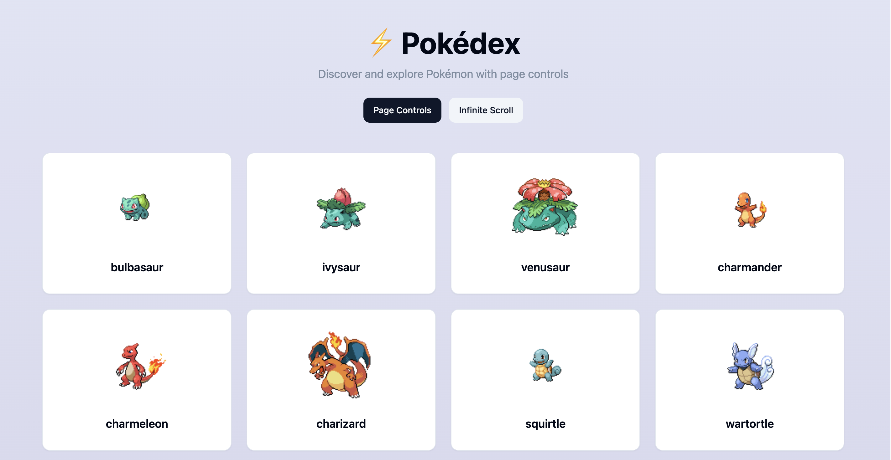
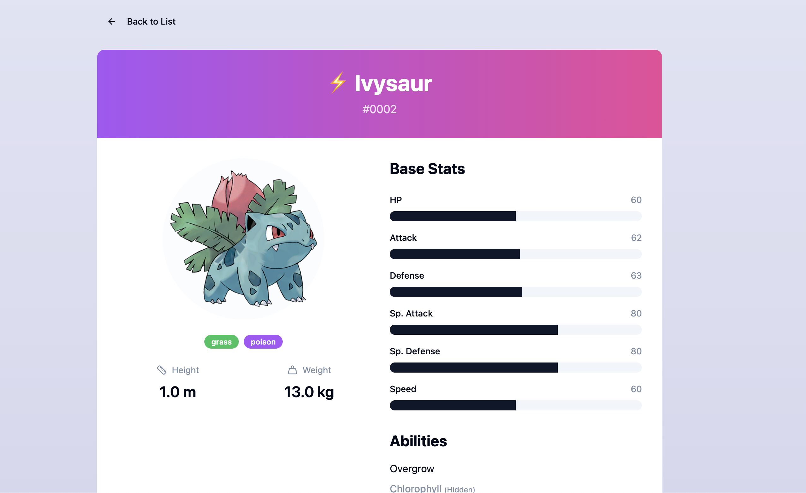
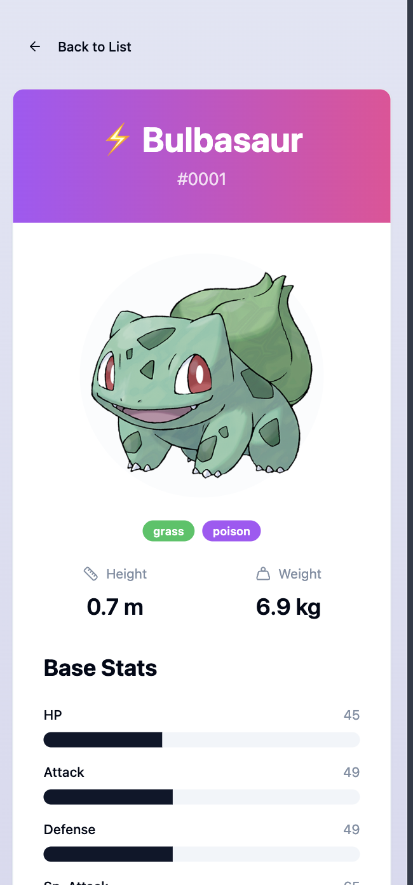

# Pokedex - Pokemon Explorer Application

<div align="center" >

<div align="center" >

<p>Mobile View</p>

</div>
</div>
A modern, responsive web application built with React and TypeScript that allows users to browse and explore Pokemon data from the PokeAPI. The application features both paginated and infinite scroll viewing modes, detailed Pokemon information pages, and a clean, intuitive user interface.

## 🚀 Features

- **Dual View Modes**: Switch between paginated view and infinite scroll
- **Pokemon List**: Browse Pokemon with beautiful card-based UI
- **Pokemon Details**: View comprehensive information about each Pokemon including:
  - Physical stats (height, weight)
  - Base stats (HP, Attack, Defense, etc.)
  - Abilities (regular and hidden)
  - Types with color-coded badges
  - Base experience
- **Responsive Design**: Fully responsive layout that works on all devices
- **Error Handling**: Comprehensive error boundaries and fallback UI
- **Loading States**: Skeleton loaders and loading indicators
- **Navigation**: Smooth routing with React Router
- **Modern UI**: Built with shadcn/ui components and Tailwind CSS

## 🛠️ Tech Stack

### Core Technologies
- **React 18.3.1** - UI library
- **TypeScript 5.8.3** - Type safety
- **Vite 5.4.19** - Build tool and dev server
- **React Router DOM 6.30.1** - Client-side routing

### State Management & Data Fetching
- **TanStack Query (React Query) 5.90.9** - Server state management, caching, and data fetching
- **Axios 1.13.2** - HTTP client for API requests

### UI & Styling
- **Tailwind CSS 3.4.17** - Utility-first CSS framework
- **shadcn/ui** - High-quality React component library
- **Radix UI** - Accessible component primitives
- **Lucide React** - Icon library
- **tailwindcss-animate** - Animation utilities

### Development Tools
- **ESLint** - Code linting
- **TypeScript ESLint** - TypeScript-specific linting rules
- **SWC** - Fast compiler for React


## 🏗️ Architecture

### Component Architecture
The project follows a component-based architecture where:
- **Pages** (`pages/`) are top-level route components
- **Components** (`components/`) are reusable UI pieces
- Components are organized as classes with static `render` methods for better organization
- Each component file is kept under 90 lines as per project standards

### Data Flow
1. **Network Layer** (`network/`): Handles all API communication
   - Uses Axios instance with base URL configuration
   - Exposes simple functions for fetching data

2. **Hooks Layer** (`hooks/`): Custom hooks for data management
   - `usePokemonData`: Manages Pokemon list data with support for both pagination and infinite scroll
   - `useInfiniteScroll`: Handles infinite scroll intersection observer logic

3. **React Query**: Provides caching, background updates, and loading states
   - Uses `useQuery` for paginated data
   - Uses `useInfiniteQuery` for infinite scroll data

4. **Components**: Consume data from hooks and display UI

### Routing
- `/` - Main page with Pokemon list
- `/pokemon/:name` - Pokemon detail page
- `*` - 404 Not Found page

Routes are lazy-loaded for better performance.

### API Configuration
The Axios instance is configured in `src/network/instance.ts`:
- Base URL: `https://pokeapi.co/api/v2/pokemon`
- Content-Type: `application/json`

## 📦 Installation & Setup

### Prerequisites
- Node.js (v18 or higher recommended)
- npm or yarn

### Installation Steps

1. **Clone the repository**
   ```bash
   git clone <repository-url>
   cd Pokedex-1
   ```

2. **Install dependencies**
   ```bash
   npm install
   ```

3. **Start development server**
   ```bash
   npm run dev
   ```
   The application will be available at `http://localhost:8080`

4. **Build for production**
   ```bash
   npm run build
   ```

5. **Preview production build**
   ```bash
   npm run preview
   ```


The project uses shadcn/ui components for a consistent, accessible UI:
- Cards for Pokemon display
- Buttons for navigation and actions
- Badges for Pokemon types
- Skeleton loaders for loading states
- Accordion for collapsible content
- And more...

All components are styled with Tailwind CSS and follow the design system.

## 🔍 Utility Functions

### Pokemon Utilities (`lib/pokemon-utils.ts`)
- `extractPokemonId`: Extracts Pokemon ID from URL
- `getPokemonImageUrl`: Generates image URL from Pokemon ID
- `getPokemonDetailImageUrl`: Gets official artwork URL
- `getTypeColor`: Returns Tailwind color class for Pokemon type
- `formatHeight`: Formats height in meters
- `formatWeight`: Formats weight in kilograms
- `getStatValue`: Extracts specific stat value
- `getRegularAbilities`: Filters regular abilities
- `getHiddenAbility`: Gets hidden ability if available

### Pagination Utilities (`lib/pagination-utils.ts`)
- `calculatePageNumbers`: Calculates page numbers to display with ellipsis logic

## 🚦 Available Scripts

- `npm run dev` - Start development server
- `npm run build` - Build for production
- `npm run build:dev` - Build in development mode
- `npm run preview` - Preview production build
- `npm run lint` - Run ESLint

## 🌐 API Integration

The application integrates with the [PokeAPI](https://pokeapi.co/):
- **List Endpoint**: `GET /pokemon?limit={limit}&offset={offset}`
- **Detail Endpoint**: `GET /pokemon/{name}`

## 🎯 Performance Optimizations

- **Lazy Loading**: Routes are lazy-loaded to reduce initial bundle size
- **React Query Caching**: Automatic caching of API responses
- **Memoization**: Use of `useMemo` for expensive calculations
- **Code Splitting**: Automatic code splitting with Vite
- **Image Optimization**: Efficient image loading strategies

## 📱 Responsive Design

The application is fully responsive with breakpoints:
- Mobile: Default styles
- Tablet: `sm:` breakpoint (640px+)
- Desktop: `lg:` breakpoint (1024px+)

Grid layouts adapt to screen size:
- Mobile: 1 column
- Tablet: 2 columns
- Desktop: 4 columns

## 🙏 Acknowledgments

- [PokeAPI](https://pokeapi.co/) for providing the Pokemon data
- [shadcn/ui](https://ui.shadcn.com/) for the component library
- [TanStack Query](https://tanstack.com/query) for data fetching

---

Built with ❤️ using React, TypeScript, and Vite
